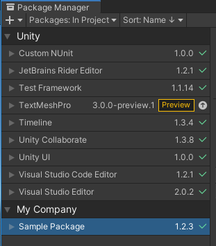
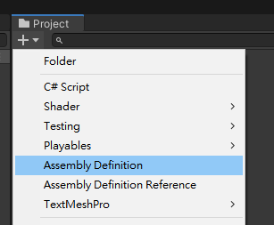
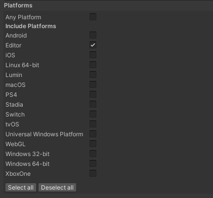
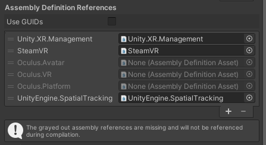
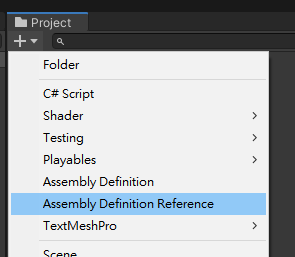
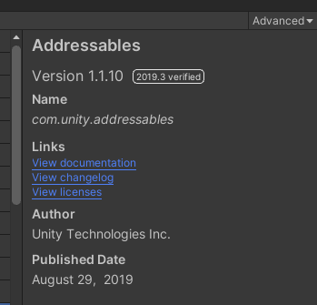
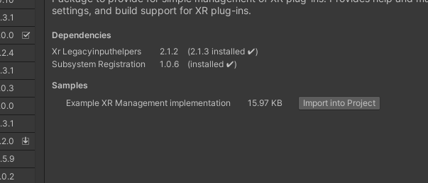

> Last Update: 2020/07/24 (Unity 2020.1: packages grouped by author, documentation URL)

## Overview

Sharing common functionality and library between projects is always a problem when it comes to Unity projects. Some may try to use [git submodule combined with symbolic links](/share-source-code-between-projects-with-git-submodule-in-unity), but somehow it seems not a decent solution. Now Unity provides the package manager like [npm](https://www.npmjs.com/) or those in other fields. I believe it's a better way to solve the problem.

This tutorial will guide you creating, developing and sharing custom packages in Unity.

## Creating Packages

The following is the [layout convention](https://docs.unity3d.com/Manual/cus-layout.html) followed by official Unity packages. Note that packages aren't Unity projects on their own. They have to be imported to a project during development, which will be mentioned later in the tutorial.

```bash
<root>
  ├── package.json
  ├── README.md
  ├── CHANGELOG.md
  ├── LICENSE.md
  ├── Editor
  │   ├── [YourCompanyName].[YourPackageName].Editor.asmdef
  │   └── EditorExample.cs
  ├── Runtime
  │   ├── [YourCompanyName].[YourPackageName].asmdef
  │   └── RuntimeExample.cs
  ├── Tests
  │   ├── Editor
  │   │   ├── [YourCompanyName].[YourPackageName].Editor.Tests.asmdef
  │   │   └── EditorExampleTest.cs
  │   └── Runtime
  │        ├── [YourCompanyName].[YourPackageName].Tests.asmdef
  │        └── RuntimeExampleTest.cs
  └── Documentation~
       └── [YourPackageName].md
```

For example, if the company name is "CoolCompany", package name is "GreatPackage", so the runtime assembly definition (`*.asmdef`) will be named `CoolCompany.GreatPackage.asmdef`.

There are some files we need to create for the custom package later, including `package.json` and `*.asmdef`.

---

### `package.json`

`package.json` is the package manifest file similar to [npm](https://www.npmjs.com/)'s. This manifest should always be placed at the root of your package. Unity package manager reads `package.json` to find out what the package is, such as name, version and dependencies.

Here is a sample `package.json` with recommended fields, please adapt this to your package:

```json
{
  "name": "com.unity.example",
  "version": "1.2.3",
  "displayName": "Package Example",
  "description": "This is an example package",
  "unity": "2019.1",
  "unityRelease": "0b5",
  "dependencies": {
    "com.unity.some-package": "1.0.0",
    "com.unity.other-package": "2.0.0"
 },
 "keywords": [
    "keyword1",
    "keyword2",
    "keyword3"
  ],
  "author": {
    "name": "My Company",
    "email": "hello@example.com",
    "url": "https://www.mycompany.com"
  }
}
```

The format of the package `name` is `com.companyname.packagename`.

The value in `version` field must follow [semantic versioning](https://semver.org/) with format `major.minor.patch`; otherwise, it will break the strategy that automation tools use to check the compatibility. `major` is for breaking changes, `minor` is for backward-compatible API changes, and `patch` is about fixes with no API changes. When `major` is 0, it indicates this package isn't stable for production, may includes many breaking changes frequently. The initial version of packages should be `0.1.0`.

As packages for Unity, use label `preview` in `version` will let package manager know it’s in preview, e.g. `1.2.3-preview.1`, `1.2.3-preview.2`.

Specify the dependencies of the package in the `dependencies` field. These referenced packages will be imported automatically when developers import this package. Please check out [npm documentation](https://docs.npmjs.com/files/package.json#dependencies) for detailed syntax about specifying version ranges, but not all the syntax are tested on Unity.

In Unity 2020.1 and later, package manager groups packages by `author` `name`:



Check out the [official documentation](https://docs.unity3d.com/Manual/upm-manifestPkg.html) of `package.json` for more details.

---

### Assembly Definitions

Starting from Unity 2017.3, [Assembly definitions](https://docs.unity3d.com/Manual/ScriptCompilationAssemblyDefinitionFiles.html) provide a way to separate your scripts into different assemblies. Each of them acts as a library within the Unity project and has its own dependencies on other assemblies. Unity reduces compilation time by only rebuilding the affected assemblies instead of whole project when you make a change. Unity's package manager fully relies on these assembly definitions. [Here](https://gametorrahod.com/how-to-asmdef-upm/) is an in-depth guide for assembly definitions in Unity.

Arranging all scripts into assembly definitions is required for packages. Assembly definitions will include all scripts in that folder and its subfolders, except for the subfolders with their own assembly definitions.

Since assembly definitions are plain text files, you can either create them with your favorite text editor or with Unity editor through the `Create` dropdown menu.



#### CompanyName.PackageName.asmdef

```json
{
    "name": "CompanyName.PackageName"
}
```

#### CompanyName.PackageName.Editor.asmdef

```json
{
    "name": "CompanyName.PackageName.Editor",
    "references": [
        "CompanyName.PackageName"
    ],
    "includePlatforms": [
        "Editor"
    ],
}
```

#### CompanyName.PackageName.Tests.asmdef

```json
{
    "name": "CompanyName.PackageName.Tests",
    "references": [
        "CompanyName.PackageName"
    ],
    "includePlatforms": [],
    "excludePlatforms": []
}
```

#### CompanyName.PackageName.Editor.Tests.asmdef

```json
{
    "name": "CompanyName.PackageName.Tests.Editor",
    "references": [
        "CompanyName.PackageName",
        "CompanyName.PackageName.Editor"
    ],
    "includePlatforms": [
        "Editor"
    ],
    "excludePlatforms": []
}
```

Editor scripts must be separated into another assembly definitions with only `Editor` in `includePlatforms` field; otherwise, editor scripts will be included during packaging, which results in missing reference errors.



Note that only in Unity 2018.4 and newer, the referenced assemblies can be optional, which means if there is any measure in the script to deal with missing references, e.g. define symbols, it’s ok to have some of the assemblies in the `references` field not found.

Personally I recommend unchecking `Use GUIDs` since it provides more information when any of the references is lost.



---

### Assembly References

Supported in Unity 2019.2 and newer, assembly references (*.asmref) provides a way to include scripts under the folder into the existing assembly definition in other places, preventing from too many assemblies just because of scattered script folders.



---

### Links



In the detail penal of Package Manager, there are some links to documentation, changelog and licenses. So far these links’ targets are hard-coded with some rules and only providing offline files, which means users must have the package installed or existing in Unity cache to open the files.

- Documentation

  Package Manager UI will find the documentation folder in the package root with this order:

  - `Documentation~` (special folder name, excluded from importing)
  - `Documentation`

  Then, it will find the entry of the documentation under the folder with this order:

  - `index.md` (case-insensitive)
  - `tableofcontents.md` (case-insensitive)
  - First found `*.md`

  In Unity 2020.1 and later, next thing it will check is `documentationUrl` field in `package.json`, which can be a link to the online documentation.

- Changelog

  Package Manager will find `CHANGELOG.md` in the package root.

- Licenses

  Package Manager will find `LICENSE.md` in the package root.

---

### Accessing Package Assets

To access assets in packages, use this path scheme:

```
Packages/com.example.package/...
```

For example:

```csharp
Texture2D texture = (Texture2D)AssetDatabase.LoadAssetAtPath("Packages/com.example.package/Example/Images/image.png", typeof(Texture2D));
```

To get the absolute path of an asset:

```csharp
string absolute = Path.GetFullPath("Packages/com.example.package/Example/Images/image.png");
```

Note that packages are read-only unless it's imported from the local disk, which means you can't create any asset into the published packages from the project.

---

### Samples



Supported in Package Manager UI 2.0 and later, You can provide some example codes or example assets, such as demo scenes and prefabs, optionally imported into user's project under the `Assets` folder. By design, scenes in pacakges can't be opened under the `Packages` folder since the packages are read-only (unless you import the package from the disk and develop it).

Add `samples` field in your `package.json`:

```json
{
  "samples": [
    {
      "displayName": "Sample 1",
      "description": "Description for sample 1.",
      "path": "Samples/sample-folder-1"
    },
    {
      "displayName": "Sample 2",
      "description": "Description for sample 2.",
      "path": "Samples/sample-folder-2"
    }
  ]
}
```

You can also exclude the sample folders from Unity's import procedure by using the [special folder names](https://docs.unity3d.com/Manual/SpecialFolders.html).

## Developing Packages

So far my personally recommended workflow is working on my game project with my custom package imported locally from disk. While I'm making my game, I can continuously add new features to my custom package and push the changes to the git repository. Note that if you imported the package from sources other than local disk, the package will be a copy of certain version storing in `/Library/PackageCache` in the project.

To import package from disk, open the package manager first, then click the plus icon at top-left corner to select your package.


## Importing Packages from Git

Currently there is no native support in Unity Editor for importing packages from git. However, you may consider trying out [UPM Git Extension](https://github.com/mob-sakai/UpmGitExtension), a custom package providing several convenient features, like importing certain branch or tag of package. (But the package isn't working properly by the time I'm writing this.)

### Installing Git

First, make sure you have [Git](https://git-scm.com/) installed and the `PATH` system environment variable has included its executable. You can type `git` in the command line to see if it recognizes the command.

### Adding Git URL to Dependencies

Open `/Packages/manifest.json` in your project and add the git URL to the dependencies array.

```json
{
  "dependencies": {
    "com.mycompany.mypackage": "https://github.com/account/my-package-project.git",
    // Other packages...
  }
}
```

It will get the `HEAD` of the repository by default. You can specify the branch or tag after the URL.

```json
{
  "dependencies": {
    "com.mycompany.mypackage": "https://github.com/account/my-package-project.git#develop",
    // Other packages...
  }
}
```

```json
{
  "dependencies": {
    "com.mycompany.mypackage": "https://github.com/account/my-package-project.git#v1.2.3",
    // Other packages...
  }
}
```

Then get back to the Unity editor, you will see the editor is resolving the packages you just add.

### Updating Packages From Git

Once you import the package from git, Unity will add a `lock` field after `dependencies` in `manifest.json` to prevent any unexpected changes to the packages. Either you want to update the package or switch the tag, you have to remove corresponding entry in the `lock` array after editing the URL.

## Scoped Package Registries

Unity supports [scoped package registries](https://docs.unity3d.com/Manual/upm-scoped.html) for you to add custom registries other than Unity default ones. If you want to host one yourself, [Verdaccio](https://www.npmjs.com/package/verdaccio) is recommended, which is very simple to setup.

### Adding Registries

In `/Packages/manifest.json`, add a `scopedRegistries` field to link the registry you want to get packages from:

```json
{
  "dependencies": {
    "com.mycompany.mypackage": "1.0.0",
    // Other packages...
  },
  "scopedRegistries": [
    {
      "name": "MyRegistry",
      "url": "https://my.company.com/registry",
      "scopes": [
        "com.mycompany"
      ]
    }
  ]
}
```

Note that only packages in namespaces listed in `scopes` will be displayed in Unity package manager window.

### Publishing Packages

Unity uses `npm` to publish the packages since the whole structure is based on `npm`. You can get `npm` by installing [Node.js](https://nodejs.org/en/).

If you're not logged in, you have to login or create an account first:

```bash
npm adduser --registry <registry-url>
```

Note that you must specify the registry url for every command, or the default registry is `npm`'s public registry, which is `https://registry.npmjs.org`.

After you logged in, change the directory to the root of the package, then publish:

```bash
npm publish --registry <registry-url>
```

If you want to unpublish any package, although it's not recommended, you can:

```bash
npm unpublish <package-name>@<version> --registry <registry-url>
```

Or if you want to unpublish all versions:
```bash
npm unpublish <package-name> --force --registry <registry-url>
```

If the target package was published less than 72 hours ago, it can be unpublished anytime; however, it needs to meet certain criteria beyond 72 hours. Check out the [npm unpublish policy](https://www.npmjs.com/policies/unpublish) for more information.

Instead of entering URL for every single command, we can also add `publishConfig` field to `package.json` to set the default registry url for publishing.

```json
"publishConfig": {
    "registry": "https://registry.mycompany.com"
}
```

## References

- [Unity - Manual: Creating custom packages](https://docs.unity3d.com/Manual/CustomPackages.html)
- [UPM: How to make a custom package](https://gist.github.com/LotteMakesStuff/6e02e0ea303030517a071a1c81eb016e)
- [Creating Custom Packages for Unity 2018.3 - neogeek.dev](https://neogeek.dev/creating-custom-packages-for-unity-2018.3/)
