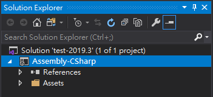
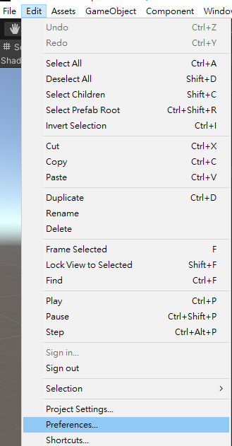
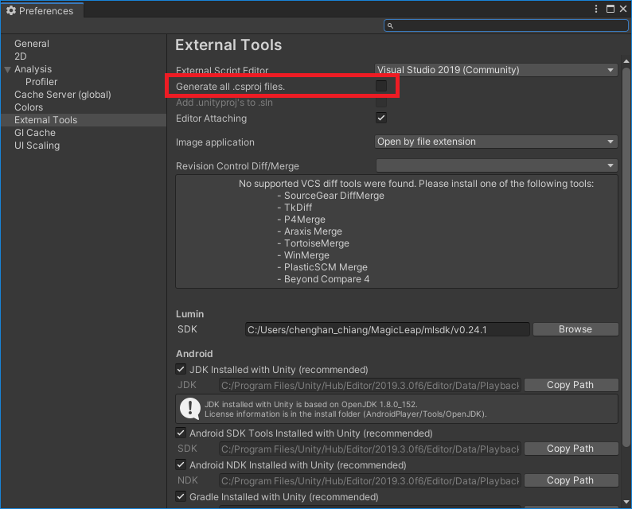
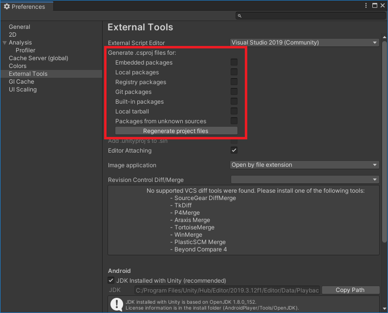
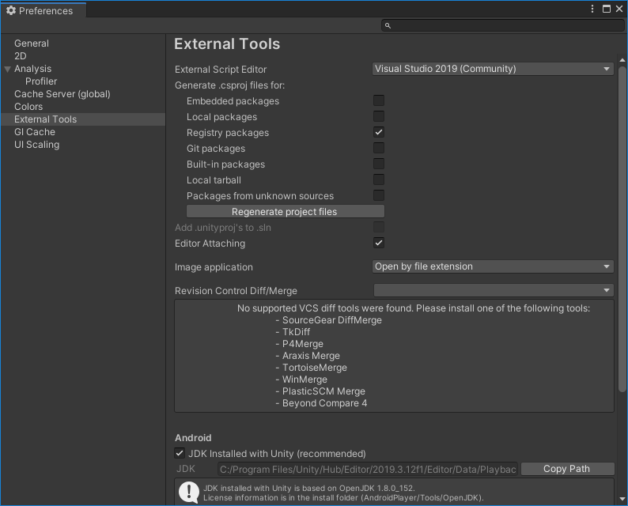
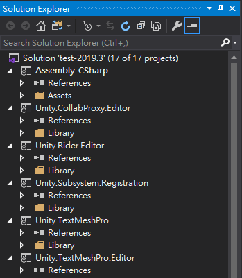

## Symptoms

By default, Unity only generates Visual Studio projects (`.csproj`) for assemblies in `Assets/` folder, including predifined assemblies (`Assembly-CSharp`, `Assembly-CSharp-Editor`) and those formed with [assembly definitions (`*.asmdef`)](https://docs.unity3d.com/Manual/ScriptCompilationAssemblyDefinitionFiles.html), but not for assemblies in imported packages. This causes some inconvenience when we want to trace code with Visual Studio.

## Environment

- Unity 2019.3.0f6 (with less options)
- Unity 2019.3.12f1 (with more options)

## Solution

### 1. Open editor preferences (`Edit` / `Preferences...`)

### 2. Select tab `External Tools` and enable `.csproj` files for packages

In Unity 2019.3.0f6, there is only one option to generate all project files.

While in Unity 2019.3.12f1, we can choose which kinds of packages we want Unity generate for.

I can't tell which version improved the options from changelog though.

If I check `Registry packages` and click `Regenerate project files`:

Then I can see the projects from registry packages are generated.

Personally I recommend generating project files for local packages only, which makes it easier to develop my own packages.

## Reference

- [Unity - Manual: Preferences](https://docs.unity3d.com/Manual/Preferences.html#External-Tools)