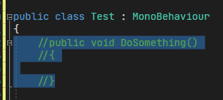
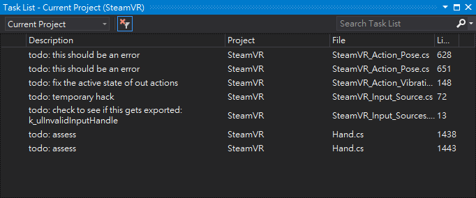
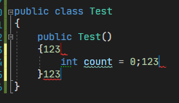
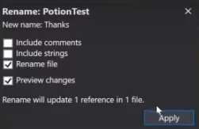

## 簡介

本文為Unite Now 2020上這場演講的重點摘要：

<iframe width="560" height="315" src="https://www.youtube.com/embed/KH0nqTpOVuM" frameborder="0" allow="accelerometer; autoplay; encrypted-media; gyroscope; picture-in-picture" allowfullscreen></iframe>

## 小技巧

以下提到的大部分功能，都是來自Visual Studio 2019 Tools for Unity，但也有少部分是Visual Studio內建。

### Roslyn Analyzers

[Roslyn analyzers](https://docs.microsoft.com/en-us/visualstudio/code-quality/roslyn-analyzers-overview?view=vs-2019)會去分析C#程式碼的風格、品質和潛在問題。Unity也實作了一些屬於它自己的分析器。

例如，當一個Unity message的內容是空的時候，它會提示你：

這裡可以查到分析器的[完整清單](https://github.com/microsoft/Microsoft.Unity.Analyzers/blob/master/doc/index.md)。

### 實作Unity Messages

- Ctrl+Shift+M

這個熱鍵會打開一個視窗，裡面列出了所有Unity messages，讓你可以從中選擇。

### Unity Project Explorer

可以在選單`View/Unity Project Explorer`找到這個功能。這個視窗會依照Unity專案的結構來顯示。

### Attach to Unity and Play

在`Attach to Unity`的下拉選單中，有個選項可以在attach之後自動幫你按play。

### 區塊註解

- **Ctrl+K, Ctrl+C**：註解
- **Ctrl+K, Ctrl+U**：消除註解

### 剪貼簿記錄

- Ctrl+Shift+V

### 代辦清單

- Ctrl+\\, T
- 或是可以在選單中找到`View/Task List`

在選項裡面也可以設定哪些關鍵字要被收集：

### 常用語法

- Ctrl+K+S

可以叫出一些常用語法，快速包住你所選擇的區塊。

### 多重編輯

- Ctrl+Alt+Click

可以選擇好幾個地方同時一起編輯。

### 自訂Unity Messages顏色

在選單`Tools/Options/General/Fonts and Colors`中：

然後在程式碼裡面看起來就會是這樣：

### 更名

- Ctrl+R, Ctrl+R

這個功能會替你把所有有用到的地方一起更名。幾乎什麼都可以用這個更名，包括變數、函式和class。當你改class名稱的時候，它甚至會幫你把檔名一起改掉。

## 沒提到的部分

演講最後一小段，我個人覺得沒有這麼受用，就沒有再花時間整理重點了，對以下主題有興趣的可以從影片的37:11開始看：

- Visual Studio Live Share
- Github for Unity (plugin)