## Overview

This is the summary of the talk on Unite Now 2020:

<iframe width="560" height="315" src="https://www.youtube.com/embed/KH0nqTpOVuM" frameborder="0" allow="accelerometer; autoplay; encrypted-media; gyroscope; picture-in-picture" allowfullscreen></iframe>

## Tips

Most of the features mentioned in the following come with Visual Studio 2019 Tools for Unity.

### Roslyn Analyzers

[Roslyn analyzers](https://docs.microsoft.com/en-us/visualstudio/code-quality/roslyn-analyzers-overview?view=vs-2019) are code analyzers in Visual Studio which inspect your C# code for style, quality and potential issues. Unity made an implementation for itself.

For example, it will hint that you left an empty Unity message:

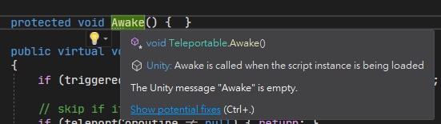

Here is the [full list](https://github.com/microsoft/Microsoft.Unity.Analyzers/blob/master/doc/index.md) of the analyzers.

### Implement Unity Messages

- Ctrl+Shift+M

This shortcut will open a window listing all the Unity message for you to pick.

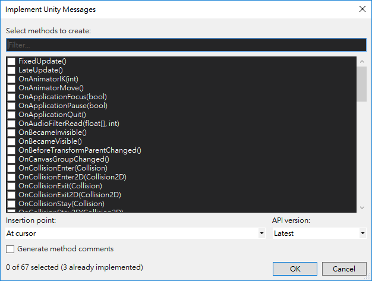

### Unity Project Explorer

In the menu `View/Unity Project Explorer`. It's an explorer allowing you to browse the scripts with the same structure as your Unity project.

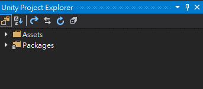

### Attach to Unity and Play

In the dropdown of `Attach to Unity`, there is an alternative option that it will hit play for you after attaching.

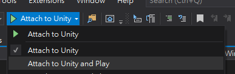

### Comment Code Block

- **Ctrl+K, Ctrl+C**: Comment
- **Ctrl+K, Ctrl+U**: Uncomment

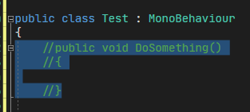

### Clipboard History

- Ctrl+Shift+V

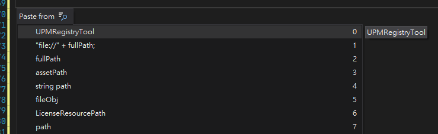

### Task List

- Ctrl+\\, T
- or, in the menu `View/Task List`

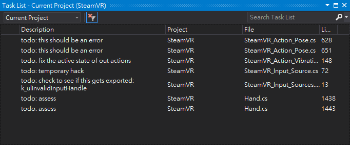

You can also edit the tokens treated as todos in the option:

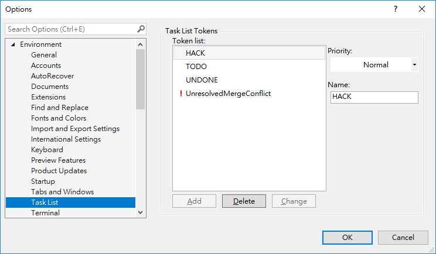

### Snippets

- Ctrl+K+S

This can quickly make your selection block surrounded with some common syntax.

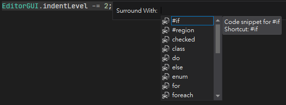

### Multi Caret

- Ctrl+Alt+Click

Allow you to select multiple places and edit them at the same time.

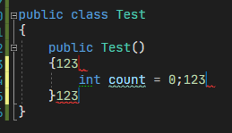

### Unity Messages Custom Color

In the menu `Tools/Options/General/Fonts and Colors`:

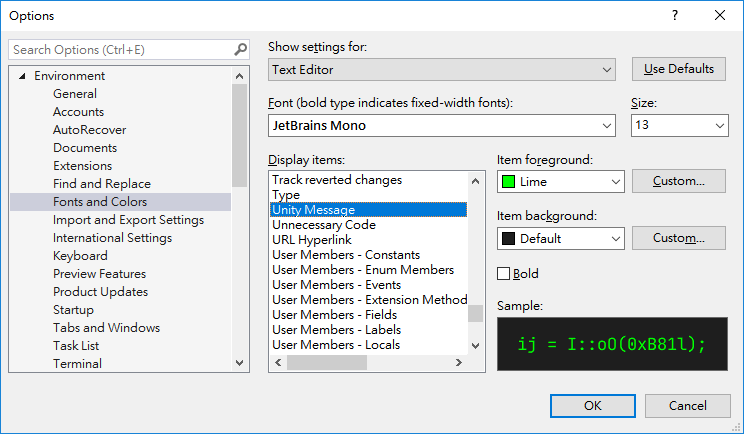

So the Unity messages will be:

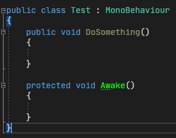

### Renaming

- Ctrl+R, Ctrl+R

This will rename the target and all the references as well. It can be used at almost everything, including variables, methods and classes. It even renames the file name when you rename a class.

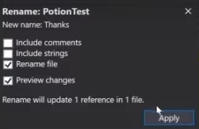

## Uncovered Parts

Some parts of the talk I personally felt not so valuable. Check them out in the video started at 37:11 if you're interested:

- Visual Studio Live Share
- Github for Unity (plugin)