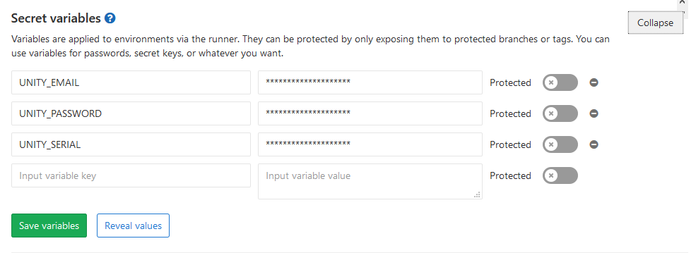
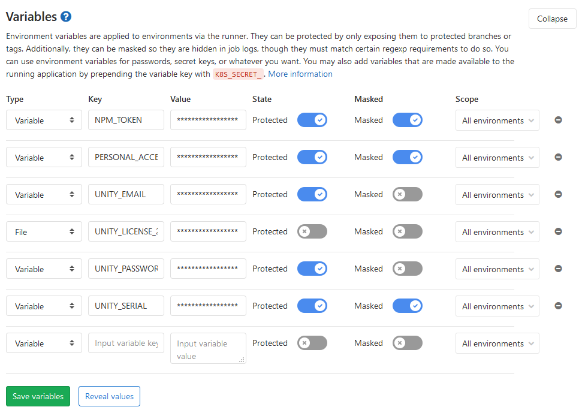

## Overview

This post is about the result of my research on Unity and Gitlab CI, showcasing a working example with Docker.

My Gitlab and Gitlab Runner are hosted in containers. Gitlab Runner uses Docker executor as well. 

## Environment

- Gitlab 10.7.0-ee
- Docker Engine 19.03.8

## Tutorial

### Base Command

This command will create an Unity instance in batch mode then quit:

```bash
xvfb-run --auto-servernum --server-args='-screen 0 640x480x24' /opt/Unity/Editor/Unity -batchmode -nographics -logfile /dev/stdout -quit
```

- [`xvfb-run`](http://manpages.ubuntu.com/manpages/trusty/man1/xvfb-run.1.html): Run an in-memory display server
  - `--auto-servernum`: Try to get a free server number
  - `--server-args='-screen 0 640x480x24'`: Pass arguments to the Xvfb server
  - `/opt/Unity/Editor/Unity`: Path to the executable, which is Unity's installation path in this case
    - `-batchmode`: Run Unity in batch mode
    - `-nographics`: Don't initialize the graphic device
    - `-logfile /dev/stdout`: Redirect output log to stdout; otherwise, there is no job logs for Unity
    - `-quit`: Quit after commands are done executing

Because we will need this base command very often, it's convenient to create a variable for it:

```yml
variables:
  UNITY_COMMAND: "xvfb-run --auto-servernum --server-args='-screen 0 640x480x24' /opt/Unity/Editor/Unity -batchmode -nographics -logfile /dev/stdout -quit"
```

Then we can use the variable later like:

```bash
eval ${UNITY_COMMAND}
```

`eval` is a built-in shell command, which evaluates the variables to the string before executing. In this case, `${UNITY_COMMAND}` will be swapped with the actual command string.

### Docker Images

There is an unofficial [docker repository](https://hub.docker.com/r/gableroux/unity3d) of Unity docker images which really helps!

We can start to create an [YAML anchor](https://medium.com/@kinghuang/docker-compose-anchors-aliases-extensions-a1e4105d70bd) for the Unity job to be easily reused:

```yml
.unity_template: &unity_template
  image: gableroux/unity3d:${IMAGE_TAG}
```

`IMAGE_TAG` should be assigned the Unity version in the jobs using this template. Check out the [available tags](https://hub.docker.com/r/gableroux/unity3d/tags) in the repository.

### License Activation

This is the most troublesome step in the automation. Unity can't be used without license, and the personal license activation procedure isn't friendly without human interference.

[Gabriel Le Breton](https://gitlab.com/gableroux/unity3d-gitlab-ci-example#how-to-activate) and [Webber Takken](https://unity-ci.com/docs/github/activation) (using Github Actions) have some ideas about it, but somehow I still haven't figured out an fully automatic way with containers.

After all, I use professional license for now, which is much easier to work with commands:

```bash
eval ${UNITY_COMMAND} -username "${UNITY_EMAIL}" -password "${UNITY_PASSWORD}" -serial "${UNITY_SERIAL}"
```

For the email, password and serial environment variables, it's better to configure them in `Settings > CI / CD > Secret Variables` in your project on Gitlab.



With Gitlab 11.10 and newer, there are more options in this section.



It's recommended to set your sensitive data masked, so they won't show in the job logs, though the content must comply with [some rules](http://localhost/help/ci/variables/README#masked-variables), which is why I can't mask all my variables.

Now we update the activation process to our template:

```yml
.unity_template: &unity_template
  image: gableroux/unity3d:${IMAGE_TAG}

  before_script:
    - eval ${UNITY_COMMAND} -username "${UNITY_EMAIL}" -password "${UNITY_PASSWORD}" -serial "${UNITY_SERIAL}"
```

We put it in the `before_script` so it will run before everything else.

Since the serial can only be activated on 2 machines, while we use containers, the license should be always returned after the job. It's good to return license in the `after_script` because it will always be executed even something encounters error in the `script`.

```yml
.unity_template: &unity_template
  image: gableroux/unity3d:${IMAGE_TAG}

  before_script:
    - eval ${UNITY_COMMAND} -username "${UNITY_EMAIL}" -password "${UNITY_PASSWORD}" -serial "${UNITY_SERIAL}"

  after_script:
    - eval ${UNITY_COMMAND} -returnLicense
```

### Opening Project

Use `-projectPath` to open a project:

```bash
eval ${UNITY_COMMAND} -projectPath='.'
```

With this, Unity will compile your scripts in editor. If there is any error, the job will be failed so you can catch the problem.

By default, Unity will try to open the project in the current directory if the path is not specified. In fact, activation command also triggers compilation in the newer Unity versions, so this command may not be necessary.

In Unity 2017.4 or older, `-projectPath .` won't work, so I use a more comprehensive syntax.

### Cache

We can save some time by [caching](https://docs.gitlab.com/ee/ci/yaml/README.html#cache) the `Library` folder in our project.

```yml
.unity_template: &unity_template
  image: gableroux/unity3d:${IMAGE_TAG}
  cache:
    key: "${CI_PROJECT_ID}-${CI_COMMIT_REF_SLUG}-${CI_JOB_NAME}"
    paths:
     - "Library/"

  before_script:
    - eval ${UNITY_COMMAND} -username "${UNITY_EMAIL}" -password "${UNITY_PASSWORD}" -serial "${UNITY_SERIAL}"

  after_script:
    - eval ${UNITY_COMMAND} -returnLicense
```

`key` is the identifier to decide which version of cache this job should use. Combined with project ID, branch and job name, this key makes the cache to be shared with the same job in the same branch and project, accelerating the job at the next time. Variables like `CI_PROJECT_ID` are [predefined in Gitlab](https://docs.gitlab.com/ee/ci/variables/predefined_variables.html).

`paths` is an array of all folders to be cached.

### Building

Assuming we are going to build the project for Win64:

```bash
eval ${UNITY_COMMAND} -projectPath='.' -buildWindows64Player 'Builds/Test.exe'
```

You can find the arguments to build for other platforms in the [manual](https://docs.unity3d.com/Manual/CommandLineArguments.html).

Make sure you have added scenes to build in the project. If you need to dynamically choose which scenes to build, you need to use `-executeMethod` and write some code with [`BuildPipeline`](https://docs.unity3d.com/Manual/BuildPlayerPipeline.html) to meet your needs.

Using the command with previous declared template by:

```yml
build:2020.1:
  <<: *unity_template
  stage: build
  variables:
    IMAGE_TAG: '2020.1.0f1-windows'

  script:
    - eval ${UNITY_COMMAND} -projectPath='.' -buildWindows64Player 'Builds/Win64/Test.exe'
```

### Artifacts

[Artifacts](https://docs.gitlab.com/ee/ci/yaml/README.html#artifacts) are the production during the process of jobs. If we want to keep and download the builds, we need to specify the paths in the job.

```yml
build:2020.1:
  <<: *unity_template
  stage: build
  variables:
    IMAGE_TAG: '2020.1.0f1-windows'

  artifacts:
    name: 'Win64'
    expire_in: 1 week
    paths:
      - `Builds/Win64`

  script:
    - eval ${UNITY_COMMAND} -projectPath='.' -buildWindows64Player 'Builds/Win64/Test.exe'
```

`name` is the name of the created artifacts archive, which could be more recognizable when you download the artifacts from Gitlab. The default name is `artifacts`.

`expire_in` allows you to set the life span of the artifact. It defaults to the [instance settings](https://docs.gitlab.com/ee/user/admin_area/settings/continuous_integration.html#default-artifacts-expiration-core-only), which is 30 days by default.

`paths` is the array of artifacts folders.

To improve the maintainability, we can use variables for output folders and output file name:

```yml
build:2020.1:
  <<: *unity_template
  stage: build
  variables:
    IMAGE_TAG: '2020.1.0f1-windows'
  
  artifacts:
    name: 'Win64'
    expire_in: 1 week
    paths:
      - ${BUILD_OUTPUT_FOLDER}

  script:
    - eval ${UNITY_COMMAND} -projectPath='.' -buildWindows64Player '${BUILD_OUTPUT_FOLDER}/${BUILD_OUTPUT_NAME}'
```

## Complete Example

This example demonstrates a Unity job template shared by 2 jobs, one tests the compilation in editor and the other tests building for Win64.

```yml
stages:
  - editor
  - build

variables:
  UNITY_COMMAND: "xvfb-run --auto-servernum --server-args='-screen 0 640x480x24' /opt/Unity/Editor/Unity -batchmode -nographics -logfile /dev/stdout -quit"
  BUILD_OUTPUT_FOLDER: 'Builds/Win64'
  BUILD_OUTPUT_NAME: 'Test.exe'

.unity_template: &unity_template
  image: gableroux/unity3d:${IMAGE_TAG}
  cache:
    key: "${CI_PROJECT_ID}-${CI_COMMIT_REF_SLUG}-${IMAGE_TAG}"
    paths:
     - "Library/"

  before_script:
    - eval ${UNITY_COMMAND} -username "${UNITY_EMAIL}" -password "${UNITY_PASSWORD}" -serial "${UNITY_SERIAL}"

  after_script:
    - eval ${UNITY_COMMAND} -returnLicense

editor:2020.1:
  <<: *unity_template
  stage: editor
  variables:
    IMAGE_TAG: '2020.1.0f1-windows'
  
  script:
    - eval ${UNITY_COMMAND} -projectPath='.'

build:2020.1:
  <<: *unity_template
  stage: build
  variables:
    IMAGE_TAG: '2020.1.0f1-windows'
  
  artifacts:
    name: 'Win64'
    expire_in: 1 week
    paths:
      - ${BUILD_OUTPUT_FOLDER}

  script:
    - eval ${UNITY_COMMAND} -projectPath='.' -buildWindows64Player '${BUILD_OUTPUT_FOLDER}/${BUILD_OUTPUT_NAME}'
```

## Reference

- [Unity - Manual: Command line arguments](https://docs.unity3d.com/Manual/CommandLineArguments.html)
- [Gabriel Le Breton / unity3d-gitlab-ci-example · GitLab](https://gitlab.com/gableroux/unity3d-gitlab-ci-example)
- [webbertakken/unity-actions: Github actions for testing and building Unity projects](https://github.com/webbertakken/unity-actions)