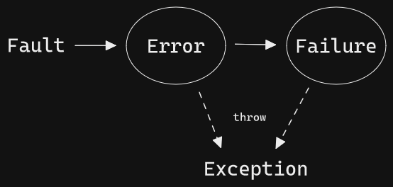
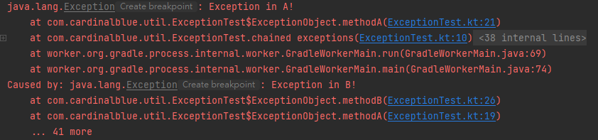

## Introduction

Most of the content is from the [blog](http://teddy-chen-tw.blogspot.com/) by Teddy, who is specialized in exception handling. It’s interpreted with my own understanding, and I think it should not be any form of golden rules.

## Taxonomy



#### Fault

- Design fault (e.g. divided by zero, null pointer)
- Component fault (e.g. storage full)

#### Error

A state caused by fault. If the fault is not handled properly, it would lead to failure state.

#### Failure

A state caused by not handling error state properly, which indicates that the system departs from its specification.

For example, when we do transactions on databases, some of them may fail (fault occurs). If we can fix the error (state) by rolling back, the system failure (state) won’t occur.

#### Exception

Representation of error and failure state.

## Robustness Levels

| Goal level | Name | State | Service |
| --- | --- | --- | --- |
| G0 | Undefined | Unknown | Unknown |
| G1 | Error-reporting | Incorrect | Failed explicitly |
| G2 | State-recovery | Correct | Failed explicitly |
| G3 | Behavior-recovery | Correct | Delivered |

#### Suggestion

- Required to be G1
- If it’s rather easy to achieve G2, go for it (e.g. database transactions, prevent memory leak)
- If it’s really important, then work hard for G3

## Bad Smells

#### Return code

```kotlin
public fun withdraw(amount: Int): Int {
    if (amount > balance) {
        return -1
    }

    // ...
}
```

- Hard to maintain when putting regular logic and exception handling together
- Developers may forget to check the return code

#### Ignored exception

```kotlin
try {
    val file = File("data.txt")
} catch (e: FileNotFoundException) {
    // ???
}
```

#### Unprotected main program

- Program will be terminated unexpectedly, which is a bad UX

#### Dummy handler

```kotlin
try {
    val file = File("data.txt")
} catch (e: FileNotFoundException) {
    Log.e(e)
}
```

- Hard to debug

#### Nested try statement

```kotlin
try {
    val file = File("data.txt")
} catch (e: FileNotFoundException) {
    // ...
} finally {
    try {
        // ...
    } catch (e: Throwable) {
        // ...
    }
}
```

- Hard to maintain
    - Replace the nested one with function
    - Prevent putting exception handling and regular logic together

#### Careless cleanup

- Cleanup in `try`

```kotlin
var stream: OutputStream? = null
try {
    stream = File("data.txt").outputStream()
    // ...
    stream.close() // Won't be executed if exception occurred
} catch (e: Throwable) {
    // ...
}
```

- Cleanup in `catch`

```kotlin
var stream: OutputStream? = null
try {
    stream = File("data.txt").outputStream()
    // ...
} catch (e: Throwable) {
    stream?.close() // Won't be executed if NO exception occurred
}
```

- Consecutive cleanup

```kotlin
var stream1: OutputStream? = null
var stream2: OutputStream? = null
try {
    stream1 = File("data1.txt").outputStream()
    stream2 = File("data2.txt").outputStream()
    // ...
} finally {
    stream1?.close()
    stream2?.close() // Won't be executed if exception occurred when stream1.close()
}
```

> In Kotlin, we may use the extension `use` instead:

```kotlin
try {
    File("data.txt").outputStream().use { outputStream -> 
        // ...
    }
} catch (e: Throwable) {
    // ...
}
```

## Context

#### Exception context

- Method name
- Stack trace
- Line number

#### Object context

- State of the object

#### Local context

- Method parameters
- Local variables

#### Application context

Sometimes the exception can’t be handled properly right at where it happens, so we may need to collect the context (exception, object, and local context) and throw again by chained exceptions.

```java
// Constructor of Exception.java
public Exception(String message, Throwable cause)
```
    
```kotlin
class ExceptionTest {
    @Test
    fun `chained exceptions`() {
        try {
            val obj = ExceptionObject()
            obj.methodA()
        } catch (e: Throwable) {
            e.printStackTrace()
        }
    }

    private class ExceptionObject {
        fun methodA() {
            try {
                methodB()
            } catch (e: Throwable) {
                throw Exception("Exception in A!", e)
            }
        }

        private fun methodB() {
            throw Exception("Exception in B!")
        }
    }
}
```


    

## Exceptions in Kotlin

> These definitions only apply to Kotlin.

#### Throwable

Base class for all exceptions and errors.

#### Exception

Subclass of `Throwable` that indicates conditions that a reasonable application might need to catch and handle, and try to recover the service back to normal. (e.g. `FileNotFoundException`, `IOException`)

**Checked exception in Java (removed in Kotlin)**
    
> In Kotlin, we can still use this feature by annotation `@Throws`.

```java
Appendable append(CharSequence csq) throws IOException;
```

```java
try {
    log.append(message)
} catch (IOException e) {
    // Must be safe
}
```

- Checked exception: All exceptions except for subclass of `RuntimeException`
- Unchecked exception: Subclass of `RuntimeException`

#### Error

Subclass of `Throwable` that indicates serious problems that a reasonable application should NOT try to catch, because it’s usually not possible to recover from them. (e.g. `OutOfMemoryError`, `StackOverflowError`)

## Best Practices

#### Do NOT handle design faults

Design faults should be fixed, not handled, such as

- Divided by zero
- Null pointer
- Index out-of-bound

#### Do NOT declare unnecessary exceptions

Declare a new exception only when it should be handled differently with existing cases.

#### Name exceptions by what problem it is

For example, it’s a repository doing bank transactions:

```kotlin
class BankAccountRepository {
    fun withdraw(int amount) {
        if (amount > balance) {
          // throw exception
        }
    }
}
```

This exception may be named:

- ❌ `BankAccountException` (named by object)
- ❌ `WithdrawException` (named by function)
- ✅ `NotEnoughBalanceException` (named by problem)
- 🤔 `TransactionException` (if all transaction exceptions should be handled in the same way)

#### Translate low-level exceptions to high-level ones

For example, we have a function which throws `IOException`:

```kotlin
fun saveProperty() {
    throw IOException()
}
```

In somewhere high-level, we handle the exception:

```kotlin
try {
    saveProperty()
} catch (e: IOException) {
    // Handle the exception
}
```

Someday we decide to change the implementation to some database which throws `SQLException`:

```kotlin
fun saveProperty() {
    throw SQLException() // Changed!
}
```

Then high-level functions will not catch the new exception.

Instead, we can consider to declare a new exception to wrap the low-level exception, e.g. `PropertyManipulationException`.

#### Do NOT rethrow all the way

If rethrowing the exception without handling just for logging from the outside, just throw once and catch with wrapped main.

## Case Studies

#### Data not found in database

- Return null → It’s reasonable to not found the data
- Throw exception (e.g. `DataNotFoundException`) → It should always be found
- Return null object → For some special requirement

#### Exceptions in observers

Do NOT throw exceptions in observers, if the subjects are not handling exceptions and terminate the notification; otherwise, the subject would crash, affecting other observers. It depends on design.

## Reference

- [Exceptions - Kotlin](https://kotlinlang.org/docs/exceptions.html)
- [笑談軟體工程：例外處理設計的逆襲](https://www.books.com.tw/products/0010637503)
- [Fault、Error、Failure、Exception](http://teddy-chen-tw.blogspot.com/2013/02/faulterrorfailureexception.html)
- [敏捷式例外處理設計的第一步：決定例外處理等級](http://teddy-chen-tw.blogspot.com/2010/03/blog-post_13.html)
- [例外處理壞味道（上）](http://teddy-chen-tw.blogspot.com/2013/12/blog-post_13.html)
- [例外處理壞味道（下）](http://teddy-chen-tw.blogspot.com/2013/12/blog-post_16.html)
- [例外處理的四種Context（1）：Exception Context](http://teddy-chen-tw.blogspot.com/2013/11/context1exception-context.html)
- [例外處理的四種Context（2）：Object Context與Local Context](http://teddy-chen-tw.blogspot.com/2013/11/context2object-contextlocal-context.html)
- [例外處理的四種Context（3）：Application Context](http://teddy-chen-tw.blogspot.com/2013/11/context3application-context.html)
- [例外處理實務做法（1）：Toward Exception-Handling Best Practices](http://teddy-chen-tw.blogspot.com/2013/12/1.html)
- [找不到資料要傳回Null還是丟出Exception？](http://teddy-chen-tw.blogspot.com/2013/11/nullexception.html)
- [例外處理和設計模式](http://teddy-chen-tw.blogspot.com/2014/03/blog-post.html)